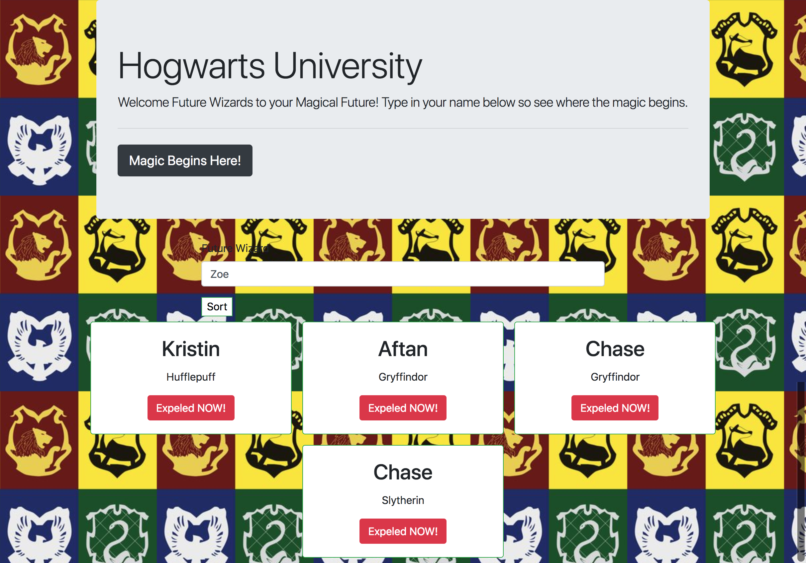

#Sorting Hats


This is the Sorting Hats Project. Type in your name and then get expelled!! 
This project have us much practice on event listeners. 

## Screenshots


## How to run this project


* Use npm to instal http-server : 
``` 
npm install -g http-server

````
* Run the server

``` sh
hs  -p 9999
```
* Open Chrome and navaigate to: 
```
localhost: http://127.0.0.1:8080/
```
